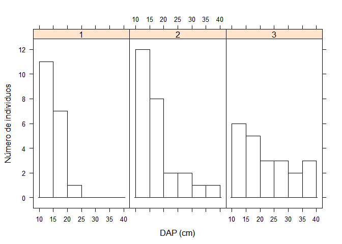
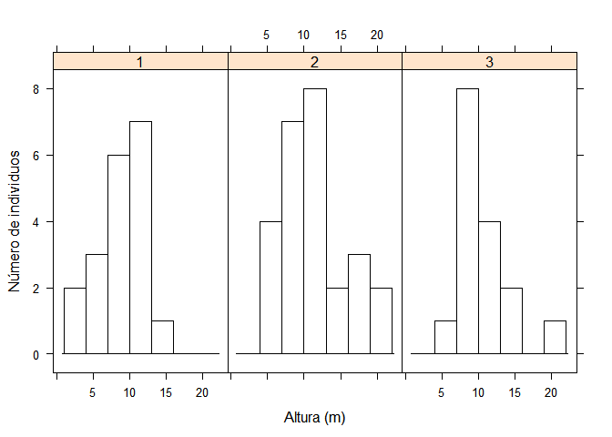
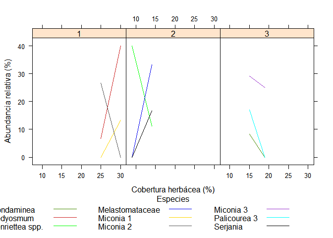
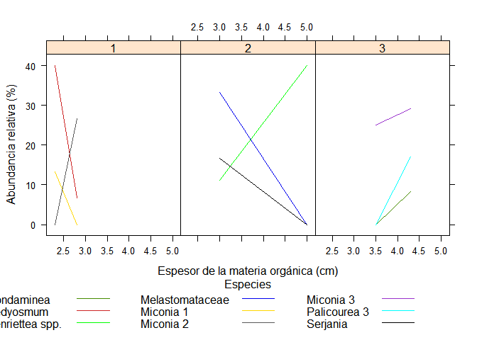
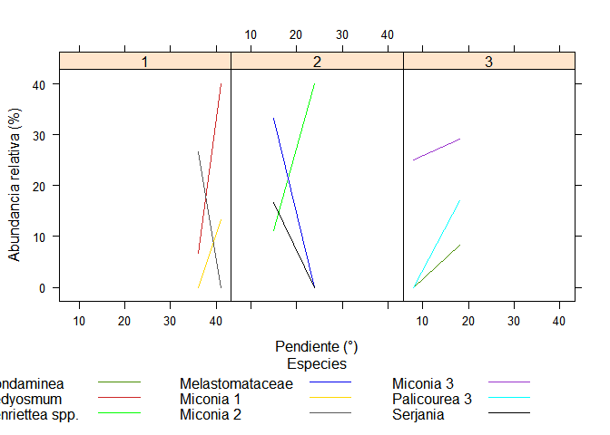
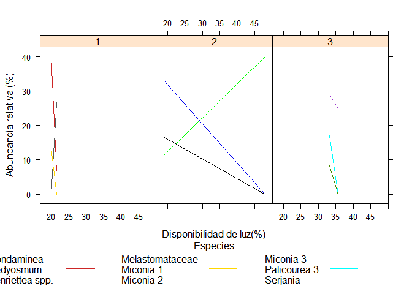
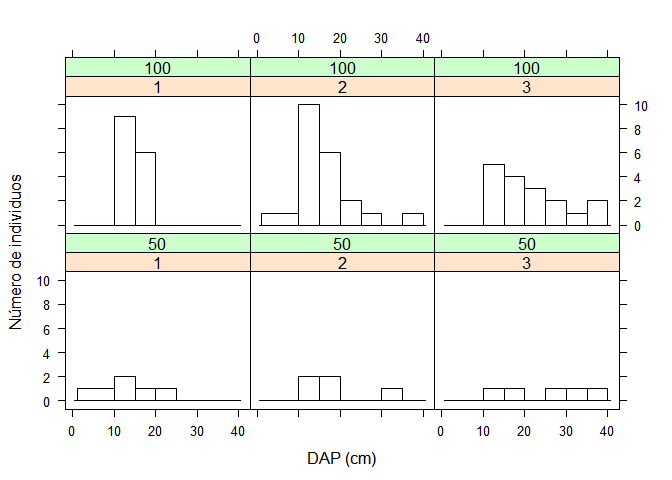
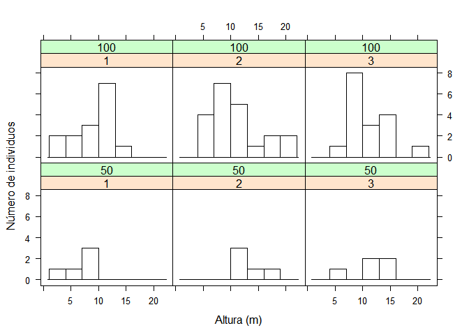

Efecto de borde
================
David Triviño

La información fue recolectada en San Rafael (Antioquia, Colombia) en
primer semestre del 2016, como un ejercicio práctico del curso de
ecología forestal II, el grupo de trabajo estaba conformado por los
estudientes de ingeniería forestal Luis Meneses, Romario Portillo,
Nicolas Echeverry y David Triviño. El ejercicio consto de dos transectos
de 100m donde se midieron e identificaron los individuos mayores a 5cm
de diametro. Se midio el diametro y la altura de estos.

``` r
library(MASS)
require(lattice)
```

    ## Loading required package: lattice

``` r
library(RColorBrewer)
```

``` r
grad=read.csv2("gradiente.csv")
datos<-read.csv2("alturas.csv")
datos$DAP=datos$CAP/pi
datos$TRAN=as.factor(datos$TRAN)
range(datos$DAP)
```

    ## [1] 10.34507 36.82845

``` r
range(datos$H)
```

    ## [1]  2.0 20.8

``` r
head(datos)
```

    ##   TRAN IND  CAP    H TIPO      DAP
    ## 1    1   1 55.5  9.4  Arb 17.66620
    ## 2    1   2 65.4  8.5  Arb 20.81747
    ## 3    1   3 41.8  5.1  Arb 13.30535
    ## 4    1   5 37.7  9.4  Arb 12.00028
    ## 5    1   6 56.1 11.3  Arb 17.85718
    ## 6    1   7 48.5 13.3  Arb 15.43803

``` r
head(grad)
```

    ##   SUB   ABU        SP TRAN COBER  MO PEN   LUZ
    ## 1  75 13.33 Miconia 1    1    30 2.3  41 19.89
    ## 2  25  0.00 Miconia 1    1    25 2.8  36 21.53
    ## 3  75 40.00 Hedyosmum    1    30 2.3  41 19.89
    ## 4  25  6.67 Hedyosmum    1    25 2.8  36 21.53
    ## 5  75  0.00 Miconia 2    1    30 2.3  41 19.89
    ## 6  25 26.67 Miconia 2    1    25 2.8  36 21.53

### Distribución Dimetro \~ altura

``` r
my.settings <- list(
  superpose.polygon=list(col="red", border="black"),
  strip.background=list(col="white"),
  strip.border=list(col="black")
)
```

``` r
histogram(~DAP|TRAN,datos, xlab = "DAP (cm)",ylab="Número de individuos",relation="same"
          , col="white",type = "count", breaks = c(10,15,20,25,30,35,40))
```

<!-- -->

``` r
datos2=subset(datos,TIPO=="Arb")
histogram(~H|TRAN,datos2, xlab = "Altura (m)",ylab="Número de individuos",relation="same", 
          col="white",type = "count",breaks = c(1,4,7,10,13,16,19,22))
```

<!-- -->

## Gradiente

``` r
color=c("chartreuse4","firebrick3","green","blue2","gold","gray35","darkorchid","cyan","black")
grad=read.csv2("gradiente.csv")
grad$TRAN=as.factor(grad$TRAN)
```

#### Cobertura herbácea

``` r
my.settings <- list(
  superpose.line=list(col=color, border="black"),
  strip.border=list(col="black")
)

par(mfrow=c(1,1))
{
  xyplot(ABU~COBER|TRAN, groups=SP,grad,type="l",auto.key=list(space="bottom", columns=4, 
  points=FALSE, lines=TRUE,title="Especies", cex.title=1),col=color,
  par.settings = my.settings, 
  ylab="Abundancia relativa (%)", xlab = "Cobertura herbácea (%)")
}
```

<!-- -->

#### Materia Orgánica

``` r
xyplot(ABU~MO|TRAN, groups=SP,grad,type="l",auto.key=list(space="bottom", columns=4, 
     points=FALSE, lines=TRUE,title="Especies", cex.title=1),col=color,
       par.settings = list(superpose.line=list(col=color)), 
       ylab="Abundancia relativa (%)", xlab = "Espesor de la materia orgánica (cm)")
```

<!-- -->

#### Pendinte del terreno

``` r
xyplot(ABU~PEN|TRAN, groups=SP,grad,type="l",auto.key=list(space="bottom", columns=4, 
   points=FALSE, lines=TRUE,title="Especies", cex.title=1),col=color,
       par.settings = list(superpose.line=list(col=color)), 
       ylab="Abundancia relativa (%)", xlab = "Pendiente (°)")
```

<!-- -->

#### Disponibilidad de luz

``` r
xyplot(ABU~LUZ|TRAN, groups=SP,grad,type="l",auto.key=list(space="bottom", columns=4, 
     points=FALSE, lines=TRUE,title="Especies", cex.title=1),col=color,
       par.settings = list(superpose.line=list(col=color)), 
       ylab="Abundancia relativa (%)", xlab = "Disponibilidad de luz(%)")
```

<!-- -->

### Estructura dimétrica y altimétrica

``` r
estructura=read.csv2("completo.csv")
estructura$TRAN=as.factor(estructura$TRAN)
estructura$sub=as.factor(estructura$sub)
e50=subset(estructura, sub==50)
e100=subset(estructura , sub==100)
head(estructura)
```

    ##       H   DAP TRAN sub
    ## 1 11.27 12.89    2  50
    ## 2 13.37 16.65    2  50
    ## 3 11.30 12.86    2  50
    ## 4 16.50 32.05    2  50
    ## 5 12.50 19.51    2  50
    ## 6 10.80 11.84    2 100

``` r
histogram(~DAP|TRAN*sub,estructura, xlab = "DAP (cm)", ylab = "Número de individuos",
          relation="same",col="white",type = "count", breaks = c(1,10,15,20,25,30,35,40))
```

    ## Warning in histogram.formula(~DAP | TRAN * sub, estructura, xlab = "DAP (cm)", :
    ## type='count' can be misleading in this context

<!-- -->

``` r
histogram(~H|TRAN*sub,estructura, xlab = "Altura (m)", ylab = "Número de individuos",
          relation="same",col="white",type = "count",breaks = c(1,4,7,10,13,16,19,22))
```

<!-- -->
